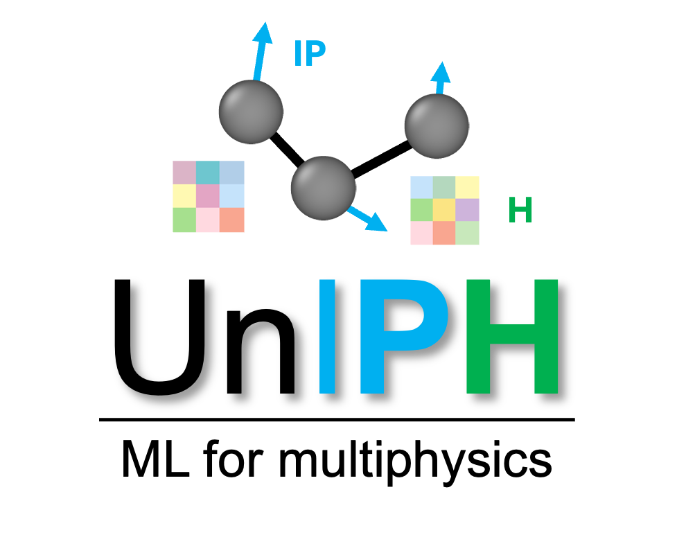
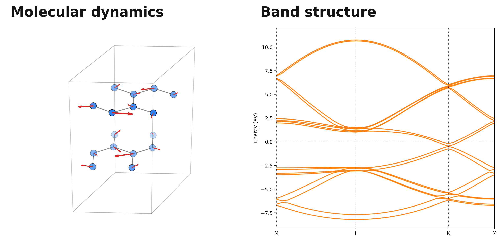
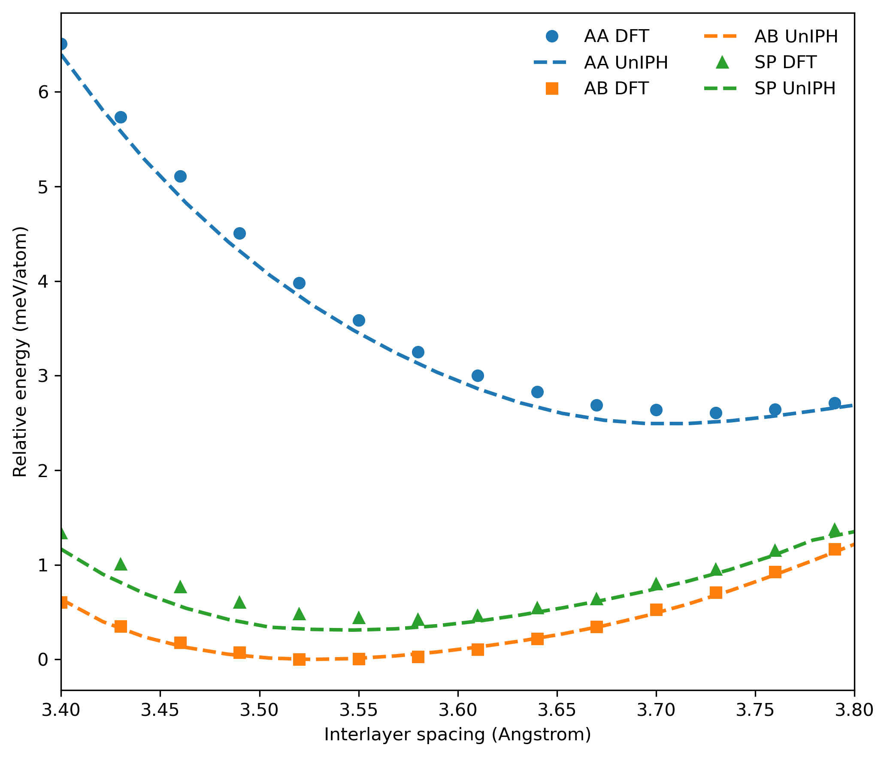
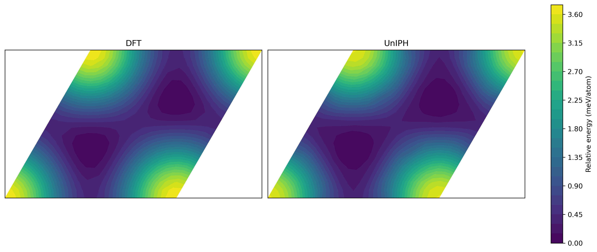
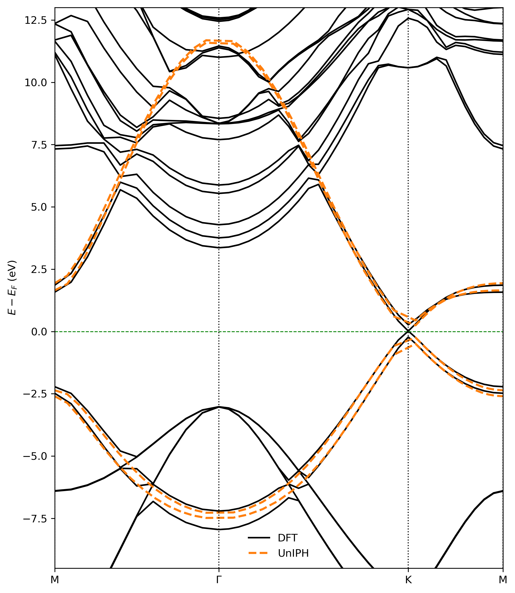
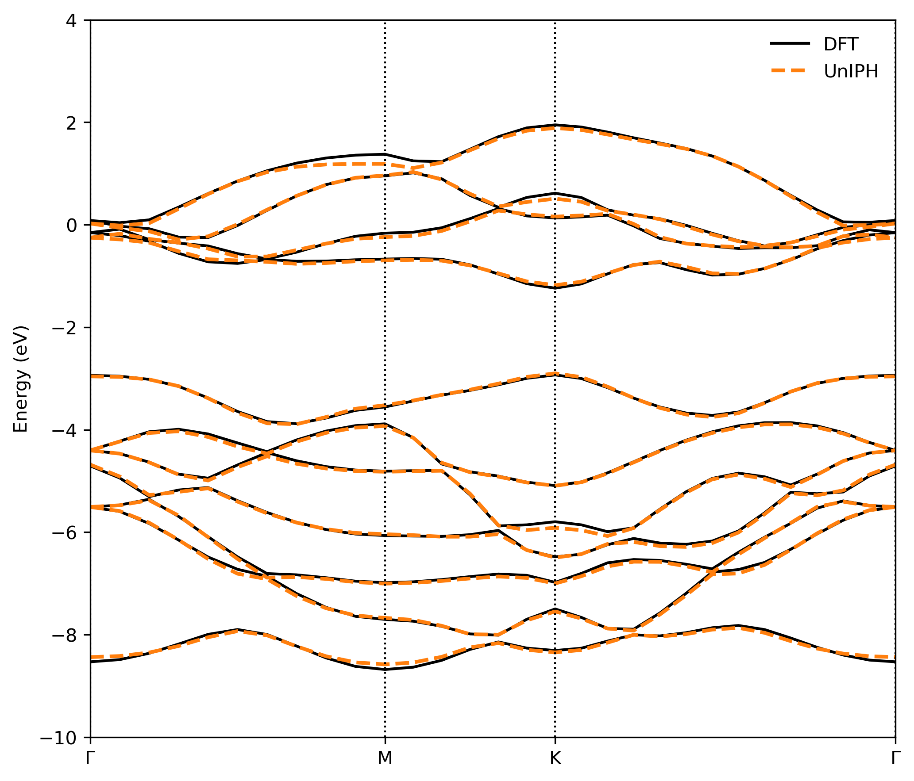
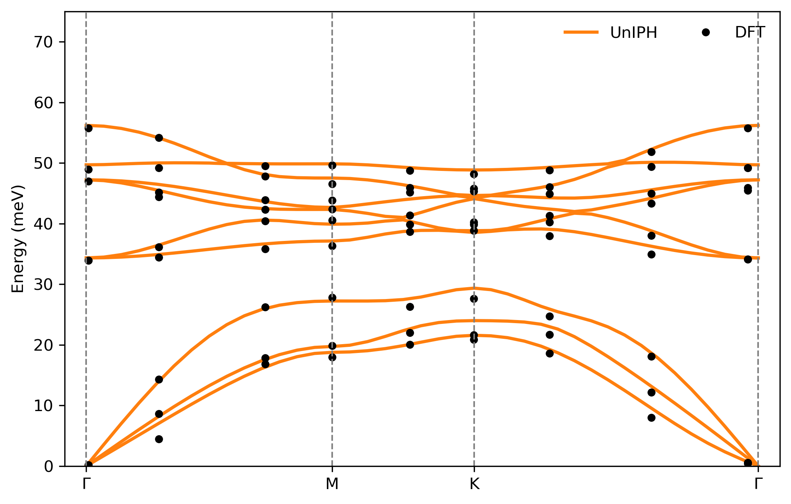

<p align="center">
  
</p>

# UnIPH

UnIPH is an equivariant graph neural network for unified interatomic potential and tight-binding hamiltonian. This release includes MoS2 and graphene as example cases, but the UnIPH framework can be applied to other material systems as well.

<p align="center">
  <br>
  <em>Graphene bilayer finite temperature simulation</em>
</p>

## Files

- `main_train.py`: trains a model from a config file.
- `main_eval.py`: evaluates a trained checkpoint and writes MAE summaries.
- `utils/`: model, data, irreps, config, and evaluation helpers.
- `gnn_config_mos2.ini`: default MoS2 configuration.
- `gnn_config_graphene.ini`: graphene configuration.
- `uniph_mos2.torch`: pretrained MoS2 checkpoint.
- `uniph_graphene.torch`: pretrained graphene checkpoint.
- `run.sh`: runs train and eval in sequence.

## Install

```bash
pip install -r requirements.txt
```

Install PyTorch, PyTorch Geometric, and `torch-scatter` using the wheel or module setup that matches your CUDA version when needed.

## Data

The graphene and MoS2 CSV files will be updated on Zenodo soon. The DFT-to-CSV
preparation process is described under `data/`.

Expected local CSV paths:

```text
data/mos2_mono/mos2.csv
data/gra_bi/data_gra_bi.csv
```

The first training or evaluation run will build the local cache:

```text
data/mos2_mono/data_mos2_mono.pkl
data/gra_bi/data_gra_bi.pkl
```

Generated `.pkl` caches are intentionally not tracked in git.

## Quick Use

Run these examples from the repository root. They use the included graphene
checkpoint; use `load_mos2_model` with a MoS2 structure for the MoS2 checkpoint.

Relax a structure with FIRE:

```python
import ase.io
from ase.optimize import FIRE

from utils.utils_calculator import UnIPHCalculator, load_graphene_model

atoms = ase.io.read("test_graphene/finite_T/structures/graphene_2x2_initial.xyz")
context = load_graphene_model(device="cpu")
atoms.calc = UnIPHCalculator(context)

relax = FIRE(atoms)
relax.run(fmax=0.05, steps=100)

print("Relaxed energy:", atoms.get_potential_energy())
```

Use UnIPH as an ASE calculator for molecular dynamics:

```python
import ase.io
from ase import units
from ase.md.velocitydistribution import MaxwellBoltzmannDistribution
from ase.md.verlet import VelocityVerlet

from utils.utils_calculator import UnIPHCalculator, load_graphene_model

atoms = ase.io.read("test_graphene/finite_T/structures/graphene_2x2_initial.xyz")
context = load_graphene_model(device="cpu")
atoms.calc = UnIPHCalculator(context)

MaxwellBoltzmannDistribution(atoms, temperature_K=300)
dyn = VelocityVerlet(atoms, timestep=1.0 * units.fs)
dyn.run(5)

print("Potential energy:", atoms.get_potential_energy())
```

Use UnIPH as a tight-binding model:

```python
import ase.io

from utils.utils_calculator import load_graphene_model, predict_tb

atoms = ase.io.read("test_graphene/Band/structures/relax_AB_rotated.xyz")
context = load_graphene_model(device="cpu")
graph, hopping_mats = predict_tb(atoms, context)

print("Number of hopping blocks:", len(hopping_mats))
print("First edge:", graph.edge_index[:, 0].tolist())
print("First hopping block shape:", hopping_mats[0].shape)
```

## Training and Evaluation

Train:

```bash
python main_train.py gnn_config_mos2.ini
```

Evaluate:

```bash
python main_eval.py gnn_config_mos2.ini
```

Graphene uses the same commands with `gnn_config_graphene.ini`.

Or run the full sequence:

```bash
bash run.sh
```

Evaluation exports are written under `eval_exports/`.

## Graphene Tests

Tested workflows: interlayer energy, GSFE, and band structure.

`test_graphene/` contains small bilayer graphene examples that use the trained
`uniph_graphene.torch` checkpoint directly.

The shared UnIPH interface is in:

```python
from utils.utils_calculator import load_graphene_model, UnIPHCalculator, predict_tb
```

Core usage:

- `load_graphene_model(...)` loads `gnn_config_graphene.ini` and the graphene checkpoint.
- `UnIPHCalculator(context)` wraps the model as an ASE calculator for energy/force tests.
- `predict_tb(atoms, context)` predicts tight-binding hoppings for band calculations.

Run the examples from the `UnIPH/` directory:

```bash
python test_graphene/inter_layer_E/run_inter_layer_E.py
python test_graphene/GSFE/run_gsfe.py
python test_graphene/Band/run_band.py
```

### Interlayer Energy

Scans AA, AB, and SP bilayer stackings over interlayer distance. UnIPH total
energies are converted to relative meV/atom using the AB minimum as the zero.

Main code:

```python
context = load_graphene_model(device=DEVICE)
calculator = UnIPHCalculator(context)
atoms.calc = calculator
energy = atoms.get_potential_energy()
```



### GSFE

Builds a 2D generalized stacking fault energy map by translating the top layer
over the in-plane lattice vectors. The left panel is DFT reference and the right
panel is UnIPH.

Main code:

```python
positions[top_mask] += val1 * a1 + val2 * a2
atoms.set_positions(positions)
energy = atoms.get_potential_energy()
```



### Band Structure

Uses UnIPH-predicted tight-binding hoppings for AB bilayer graphene, constructs
the Bloch Hamiltonian along `M-Gamma-K-M`, and compares with the DFT band file.

Main code:

```python
graph, hopping_mats = predict_tb(atoms, context)
ham[src, dst] += hop * np.exp(2j * np.pi * np.dot(k_frac, shift))
energies = np.linalg.eigvalsh(ham)
```



## MoS2 Tests

Tested workflows: band structure and phonon dispersion.

`test_mos2/` contains two monolayer MoS2 examples built from the archived MoS2
reference files.

The shared UnIPH interface is:

```python
from utils.utils_calculator import load_mos2_model, UnIPHCalculator, predict_tb
```

Run the examples from the `UnIPH/` directory:

```bash
python test_mos2/Band/run_band.py
python test_mos2/Phonon/run_phonon.py
```

### MoS2 Band Structure

Loads `uniph_mos2.torch`, predicts multi-orbital tight-binding hopping blocks,
constructs the Bloch Hamiltonian along `Gamma-M-K-Gamma`, and overlays the DFT
bands from `test_mos2/Band/reference/bands.out.gnu`.

Main code:

```python
graph, hopping_mats = predict_tb(atoms, context)
ham[src_slice, dst_slice] += hop_matrix * np.exp(2j * np.pi * np.dot(k_frac, shift))
energies = np.linalg.eigvalsh(ham)
```



### MoS2 Phonon

Wraps UnIPH as an ASE calculator, runs finite-displacement phonons with a
`3x3x1` supercell, and compares the resulting phonon bands with the DFT points
in `test_mos2/Phonon/reference/df_phonon.csv`.

Main code:

```python
calculator = UnIPHCalculator(context)
ph = Phonons(atoms, calculator, supercell=(3, 3, 1), delta=0.01)
bs = ph.get_band_structure(path)
```



## Citation

```bibtex
@article{choi2025graph,
  title={Graph Neural Network for Unified Electronic and Interatomic Potentials: Strain-tunable Electronic Structures in 2D Materials},
  author={Choi, Moon-ki and Palmer, Daniel and Johnson, Harley T},
  journal={arXiv preprint arXiv:2510.16605},
  year={2025}
}
```
